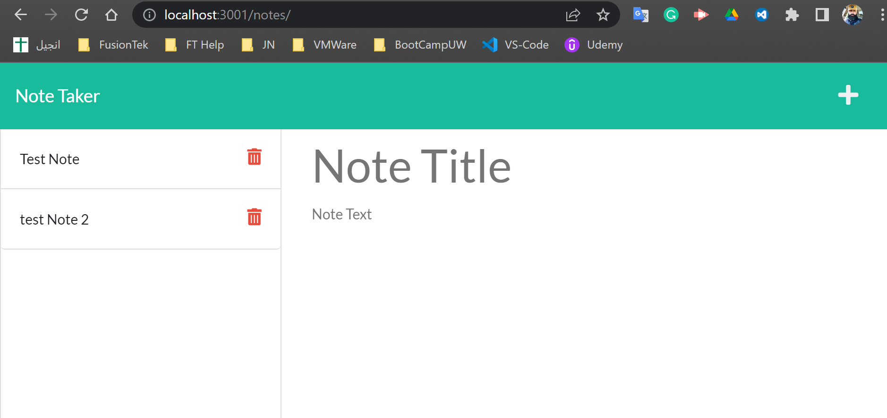
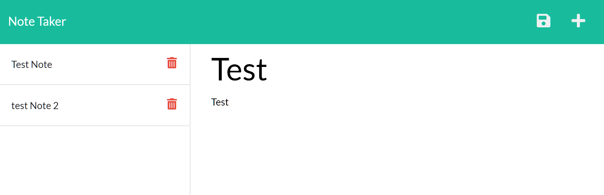
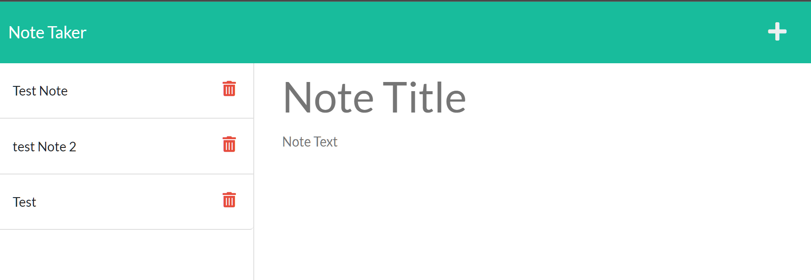

# Note Taker

## Description 
This app designed to create an application called Note Taker that can be used to write and save notes. This application will use an Express.js back end and will save and retrieve note data from a JSON file.

## demo
https://drive.google.com/file/d/1A1cuBUWskPU4bCimEcMLhFummOlThXX_/view

## github link 
https://github.com/neiman924

## Table of Contents

- [Installation](#installation)
- [Usage](#usage)
- [Credits](#credits)
- [License](#license)
- [Tests](#tests)
- [Questions](#questions)

## installation
The application will be invoked by using the following command: npm I  => “npm start”

## usage
AS A small business owner I WANT to be able to write and save notes SO THAT I can organize my thoughts and keep track of tasks I need to complete
    ## screenshot
    
    
    
 
## credits
none

## license

# none
# none

## tests

## questions
- Please send me email if you had any questions, my email address is :
 neiman924@gmail.com

